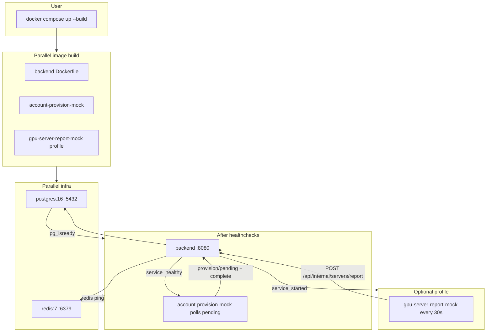
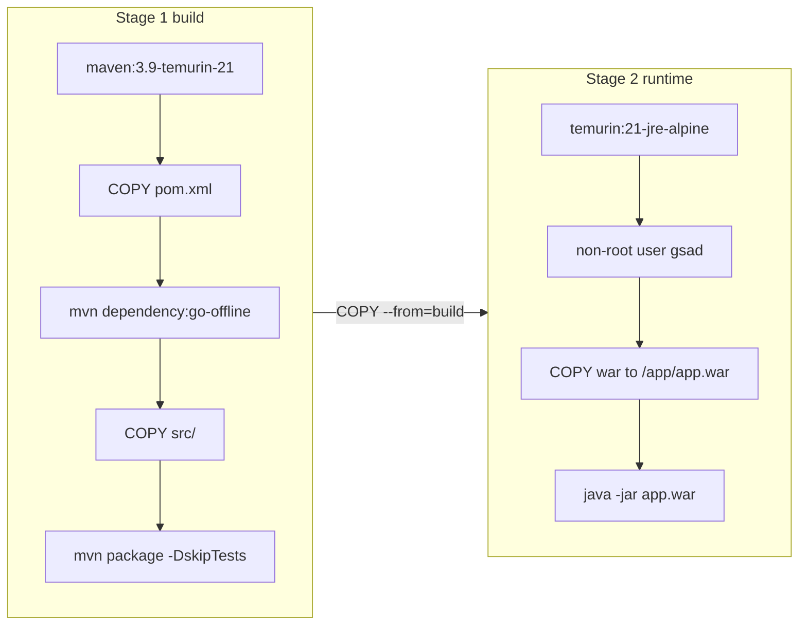
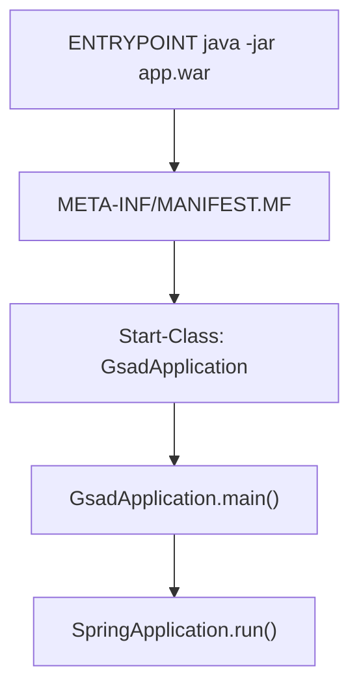
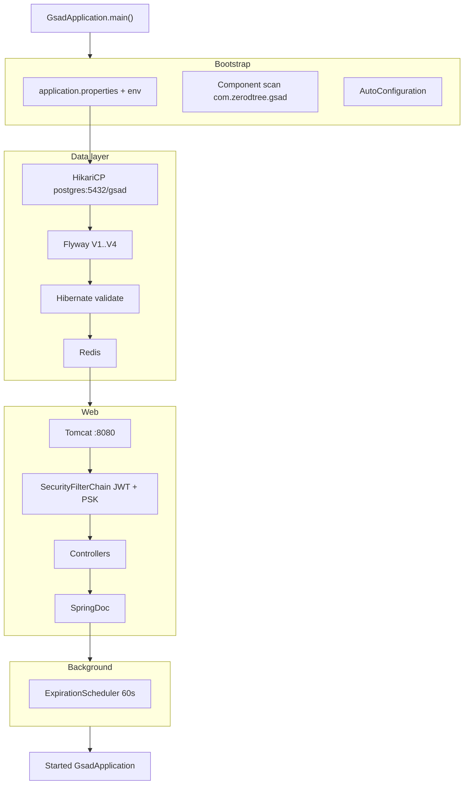
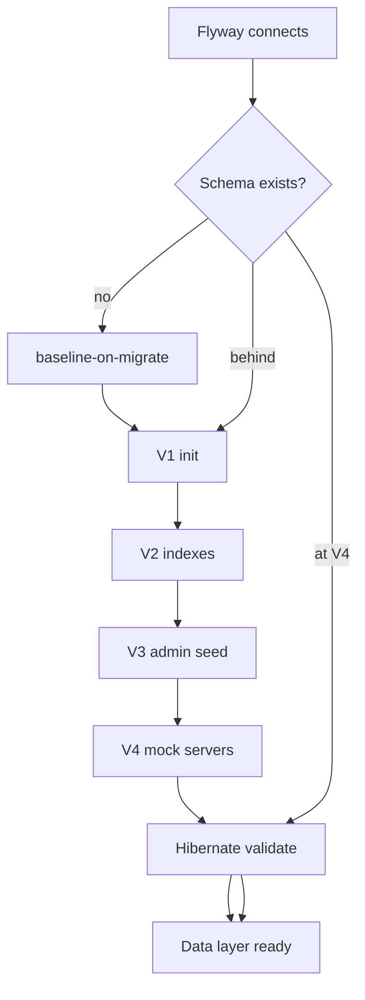
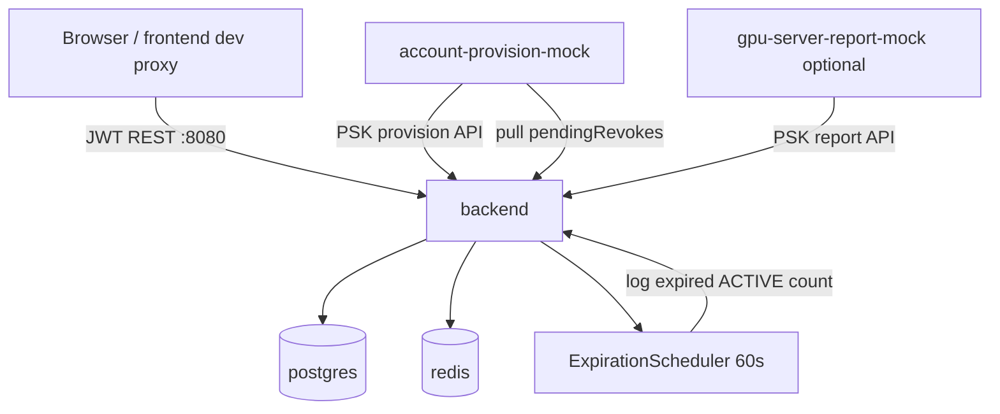

# GSAD Startup Flow

From `docker compose up` through backend readiness: image build, container orchestration, JVM/Spring Boot init, and optional mocks.

---

## Docker Compose startup order

Default:

```bash
docker compose up --build
```

Optional GPU metrics mock:

```bash
docker compose --profile gpu-server-report-mock up --build
```



| Stage | Service | Port | Ready when |
|-------|---------|------|------------|
| 1 | postgres | 5432 | `pg_isready` |
| 1 | redis | 6379 | `PING` ok |
| 2 | backend | 8080 | postgres + redis healthy |
| 3 | account-provision-mock | — | backend healthy; polls every 10s |
| 4 (optional) | gpu-server-report-mock | — | backend healthy; reports every 30s |

---

## Backend image build (Dockerfile)



Cache: `pom.xml` changes invalidate dependency layer; `src/` changes only re-run `package`.

---

## JVM entry



`ServletInitializer` is for external Tomcat WAR deploy only; `java -jar` uses `GsadApplication.main()`.

---

## Spring Boot startup (backend container)



### Environment mapping

| Env | Property |
|-----|----------|
| `DB_HOST`, `DB_USER`, `DB_PASSWORD` | `spring.datasource.*` |
| `REDIS_HOST`, `REDIS_PASSWORD` | `spring.data.redis.*` |
| `JWT_SECRET` | `jwt.secret` |
| `AGENT_PSK` | `agent.psk` |

### Flyway on empty database



---

## Infrastructure services

**postgres:** PG 16, db `gsad`, volume `postgres_data`, healthcheck `pg_isready`.

**redis:** Redis 7, `--requirepass`, healthcheck `redis-cli ping`.

**account-provision-mock:** `provision_loop.py` polls `provision/pending`, completes grants/revokes. Contract: [agent-provision.md](agent-provision.md).

**gpu-server-report-mock** (profile): `report-loop.sh` POSTs to `/api/internal/servers/report` for mock `serverId` values.

---

## Runtime topology



---

## Verification

| Check | How |
|-------|-----|
| Backend alive | `curl -sf http://localhost:8080/v3/api-docs` (compose healthcheck) |
| List servers | `GET /api/servers` — **requires JWT** (register/login first) |
| Provision mock | `account-provision-mock` logs show grant/revoke complete |
| Swagger | http://localhost:8080/swagger-ui.html |
| Mock GPU count | 30 servers after Flyway (`gpu-mock-001` … `030`) |
| Metrics mock | Profile logs: `[gpu-server-report-mock] reported ...` |

---

## Common failures

| Symptom | Fix |
|---------|-----|
| Port 8080 in use | `docker compose down --remove-orphans` |
| postgres/redis not healthy | Check `.env` and container logs |
| Flyway migration failed | Wipe volume after squash: `docker compose down -v`, then `up --build` |
| Missing secrets | Set `JWT_SECRET`, `DB_PASSWORD`, etc. in `.env` |

---

## File index

| File | Role |
|------|------|
| [../docker-compose.yml](../docker-compose.yml) | Service orchestration |
| [../Dockerfile](../Dockerfile) | Multi-stage backend build |
| [../pom.xml](../pom.xml) | Maven deps and WAR packaging |
| [../src/main/java/com/zerodtree/gsad/GsadApplication.java](../src/main/java/com/zerodtree/gsad/GsadApplication.java) | Main class |
| [../src/main/resources/application.properties](../src/main/resources/application.properties) | Runtime config |
| [../src/main/resources/db/migration/](../src/main/resources/db/migration/) | Flyway scripts |
| [agent-provision.md](agent-provision.md) | Internal provision contract |
| [../dev/account-provision-mock/](../dev/account-provision-mock/) | Dev provisioner mock |
