# GSAD 启动流程图

本文描述从 `docker compose up` 到 Backend 就绪的完整启动链路，涵盖镜像构建、容器编排、JVM/Spring Boot 初始化与可选 Mock 组件。

---

## 总览：Docker Compose 启动顺序

默认命令：

```bash
docker compose up --build
```

可选 GPU 指标 Mock（profile）：

```bash
docker compose --profile gpu-server-report-mock up --build
```

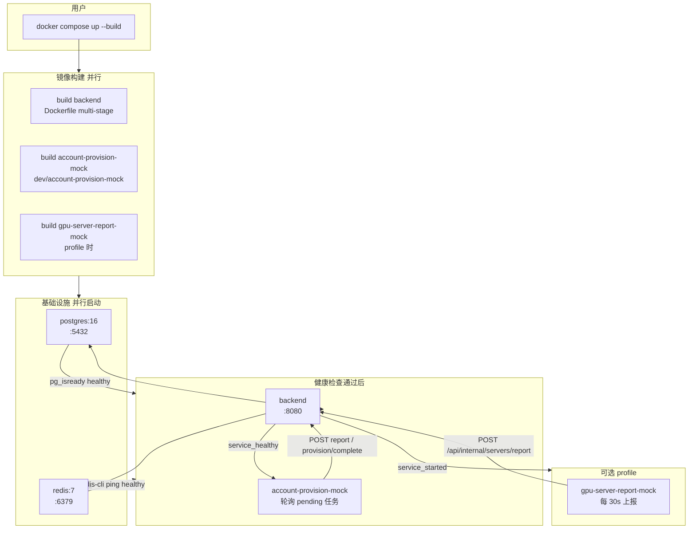

| 阶段 | 服务 | 端口 | 就绪条件 |
|------|------|------|----------|
| 1 | postgres | 5432 | `pg_isready` |
| 1 | redis | 6379 | `PING` 成功 |
| 2 | backend | 8080 | postgres + redis healthy 后启动 |
| 3 | account-provision-mock | — | backend healthy 后开始轮询 report |
| 4（可选） | gpu-server-report-mock | — | backend `started` 后开始循环上报 |

---

## Backend 镜像构建流程（Dockerfile）

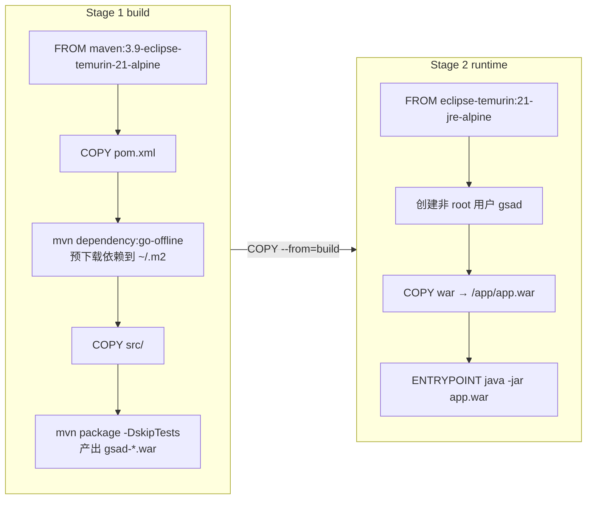

**缓存策略**：仅 `pom.xml` 变更时复用 `go-offline` 层；仅 `src/` 变更时复用依赖层、只重新 `package`。

---

## JVM 启动入口约定

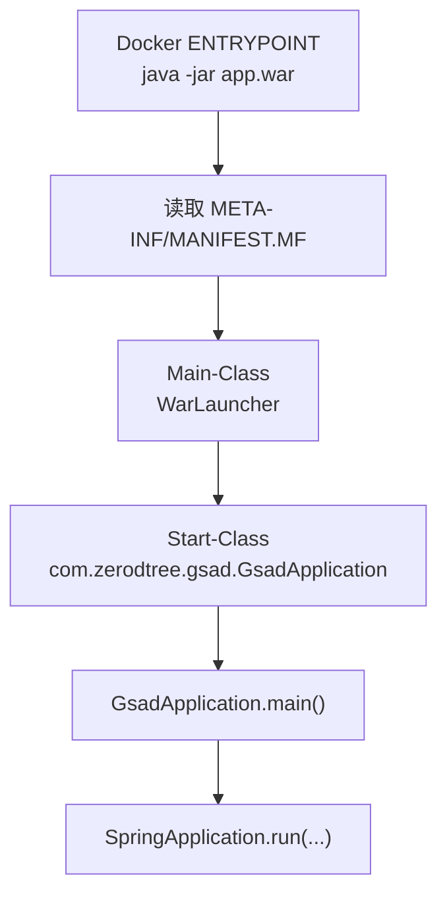

| 层级 | 说明 |
|------|------|
| Dockerfile | 只指定 `java -jar`，不写 Java 类名 |
| `spring-boot-maven-plugin` | 打包时写入 `Start-Class` |
| `GsadApplication` | `@SpringBootApplication` + `main` 方法 |
| `ServletInitializer` | 仅外部 Tomcat 部署 WAR 时使用；`java -jar` 不走此路径 |

---

## Spring Boot 应用启动流程（backend 容器内）

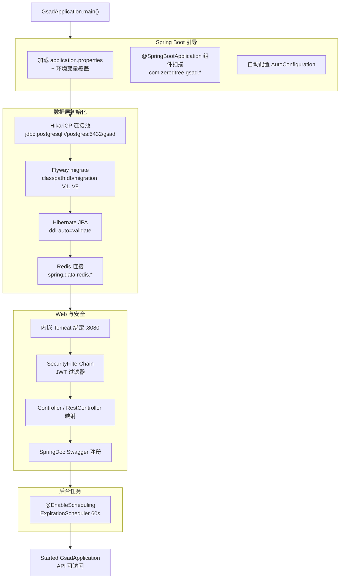

### 1 关键配置与环境变量（compose → backend）

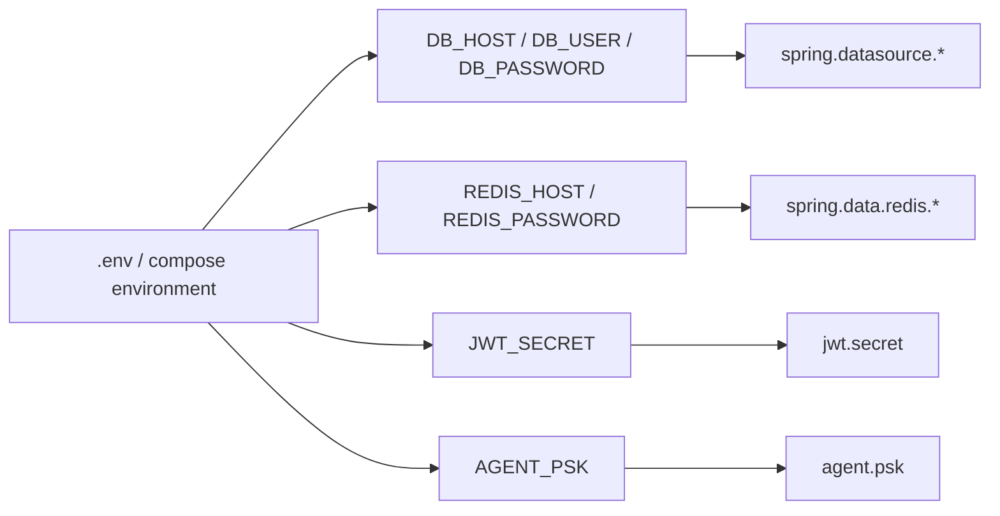

### 2 Flyway 首次启动（数据库为空）

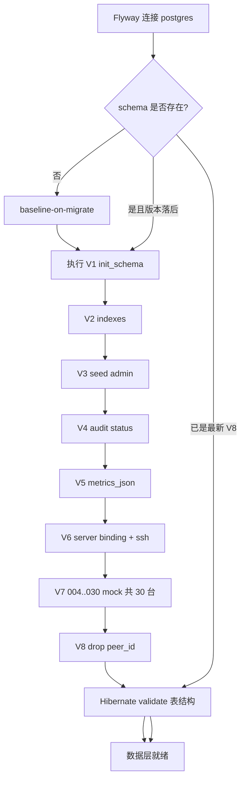

---

## 基础设施容器启动细节

### 1 postgres

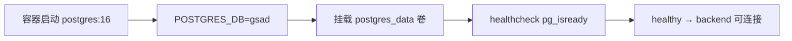

### 2 redis

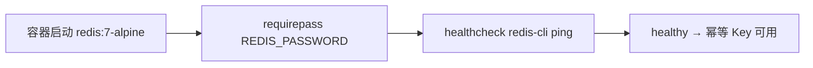

### 3 account-provision-mock

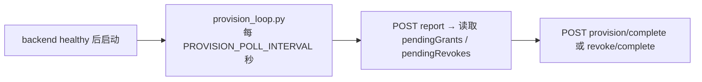

契约详见 [agent-provision.md](./agent-provision.md)。

---

## 可选：gpu-server-report-mock 启动（profile）

> 默认 dev 栈中 `account-provision-mock` 已自带 report 轮询；此 profile 仅用于单独压测指标上报。

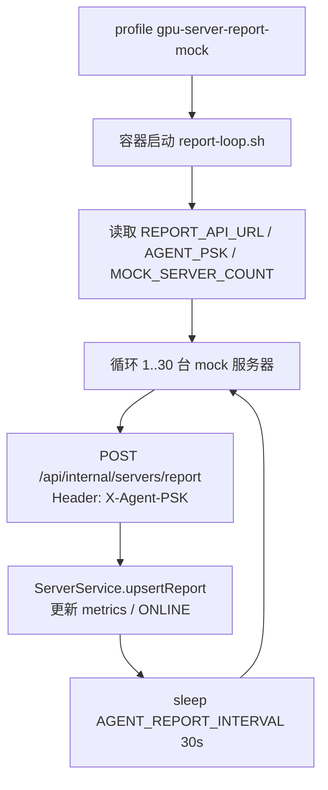

---

## 启动完成后的运行时拓扑

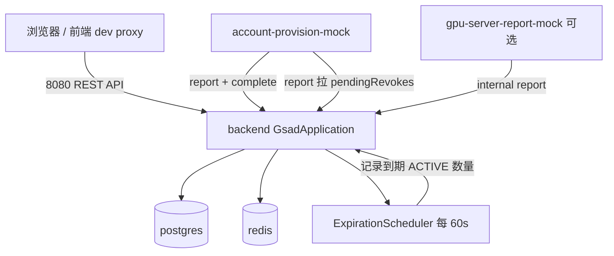

---

## 启动后快速验证

| 检查项 | 命令 / 地址 |
|--------|-------------|
| Backend 存活 | `curl -s http://localhost:8080/api/public/servers` |
| 账号开通 mock | 容器日志见 `account-provision-mock` 的 `provision complete` |
| Swagger | http://localhost:8080/swagger-ui.html |
| 服务器数量 | Flyway 种子后应有 30 台 mock GPU |
| GPU 动态上报 | 启用 profile 后日志见 `[gpu-server-report-mock] reported ...` |

---

## 常见启动失败点

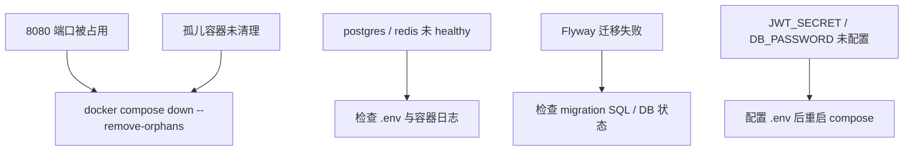

---

## 相关文件索引

| 文件 | 作用 |
|------|------|
| [docker-compose.yml](./docker-compose.yml) | 服务编排与依赖顺序 |
| [Dockerfile](./Dockerfile) | Backend 镜像构建与 `java -jar` 入口 |
| [pom.xml](./pom.xml) | Maven 依赖与 `spring-boot-maven-plugin` 打包 |
| [GsadApplication.java](./src/main/java/com/zerodtree/gsad/GsadApplication.java) | Spring Boot 主类 |
| [application.properties](./src/main/resources/application.properties) | 运行时配置 |
| [db/migration/](./src/main/resources/db/migration/) | Flyway 数据库迁移 |
| [agent-provision.md](./agent-provision.md) | 内部 report / complete 契约 |
| [dev/account-provision-mock/](./dev/account-provision-mock/) | Dev 环境模拟外部 provisioner |


# Spring 注解分层

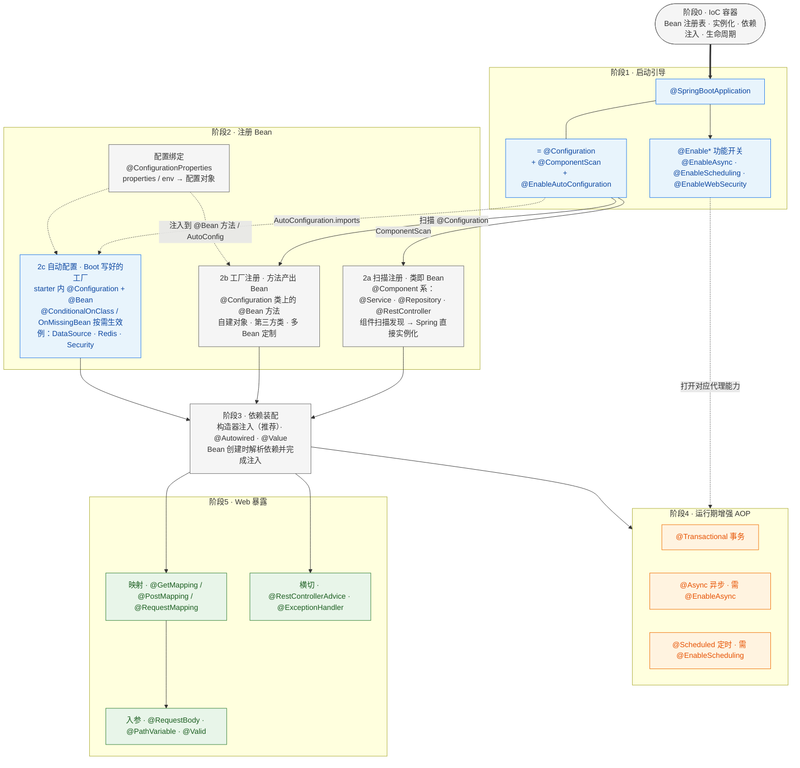
